## Before you start

You need: a Shopify store with products whose descriptions actually describe them (material, size, colour - in any language), and fifteen minutes of attention. The app never writes anything without showing you first.

Everything in steps 1, 2 and 3 is free and stays free. Nothing expires.

## Step 1 - Install and see what the app would do

Install from the App Store. The first screen shows your own product count and a live sample: one of your products with the attributes the app would extract - read from your catalogue just now, not a demo.

Press **Check now** under the crawler card. The app asks your own store for a product page as each of eight AI crawlers, with the exact user agent each uses, and reports who got in. Green means readable; a red tile comes with the cause and the fix on the Diagnostics screen.

## Step 2 - Process three products, free

Open **Products**, pick any three, and press Process on each. They are processed in full: attributes, summary, FAQ block, plain text page. These three are yours to keep whether you subscribe or not; the same three can be reprocessed as often as you like without spending a fourth.

Open one of them. Beside the editable fields the app shows what an assistant can quote about it, built strictly from what is now published.

## Step 3 - Set up your dictionary

Open **Dictionary**. Pick the preset for your trade. The preset terms are in English; translate them into the language your descriptions use: "Material: oak, walnut" becomes "Material: stejar, nuc". This is the single most important step. The Test result panel shows live what your catalogue produces.

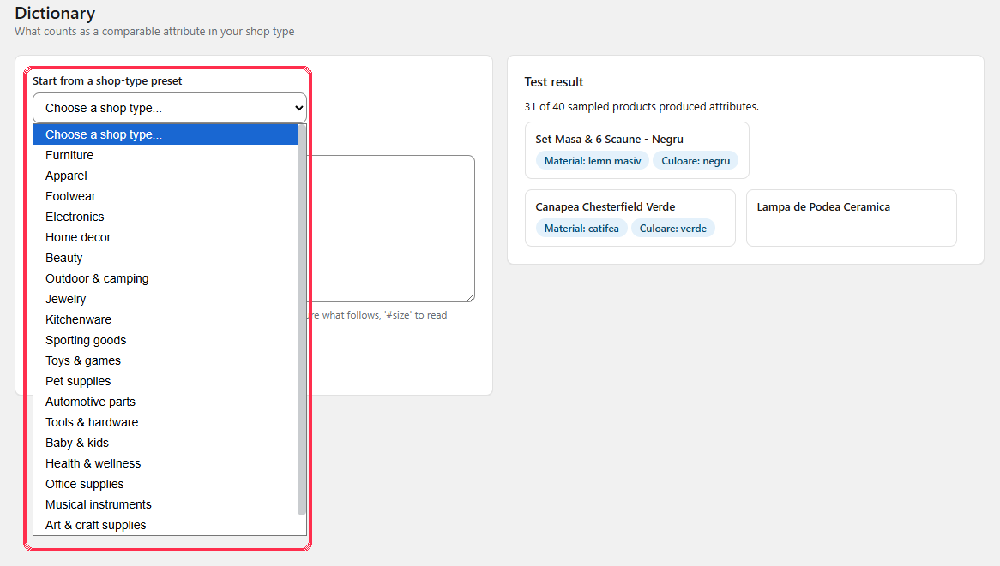

The Dictionary screen needs a subscription. If you are still on the free plan, the dashboard's Preview changes shows the same coverage figure with the default dictionary, and it writes nothing.

## Step 4 - Preview, then fill

On the Dashboard, press **Preview changes**: it writes nothing and reports what a real pass would find. Then, with a subscription, press **Fill catalogue**. The work runs on our servers - closing the tab loses nothing.

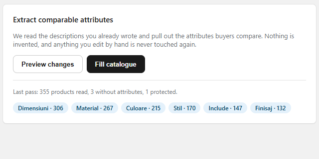

## Step 5 - Switch on the storefront output

Nothing reaches your storefront until this step. Theme editor (Online Store - Themes - Customize), puzzle icon in the left bar, App embeds. Switch on AI Visibility and Save. Leave Structured data mode on Extend unless the Diagnostics screen tells you your theme emits no product data of its own. The Dashboard's Setup card verifies this against your live theme.

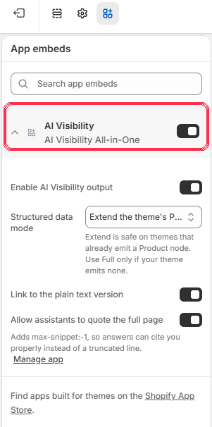

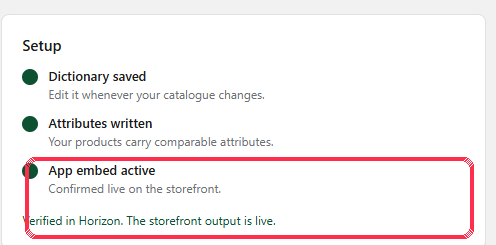

## Step 6 - Give your collections something to say

Open **Collections** and press Build collection pages. Note the honesty: a collection where nothing varies says so, instead of publishing a useless table. To show tables to visitors: theme editor on a collection page - Add section - AI Visibility comparison - Save.

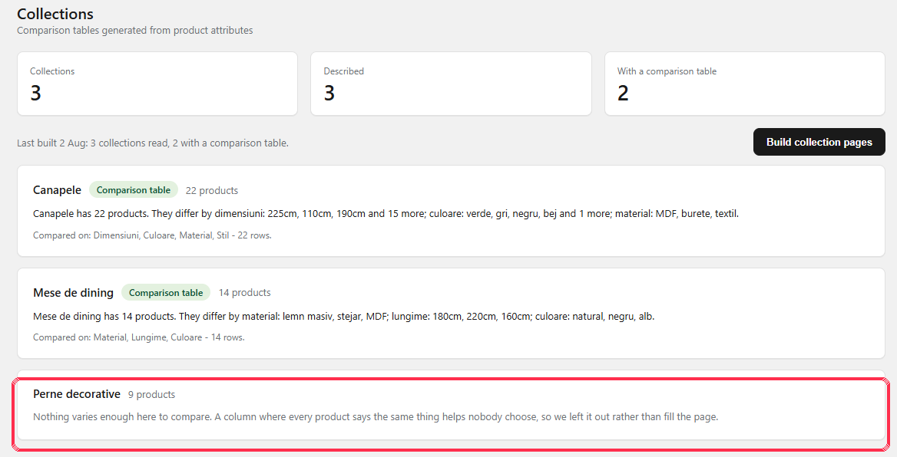

## Step 7 - Answer the commercial questions once

Open **Business**: delivery, returns, warranty, payment. Tick "This is a starting price" if your shipping cost varies. Add your official profiles - Facebook, Instagram and the rest - as full https addresses. Save, then run Fill catalogue once more. Empty fields publish nothing - leaving them empty is a complete setup too.

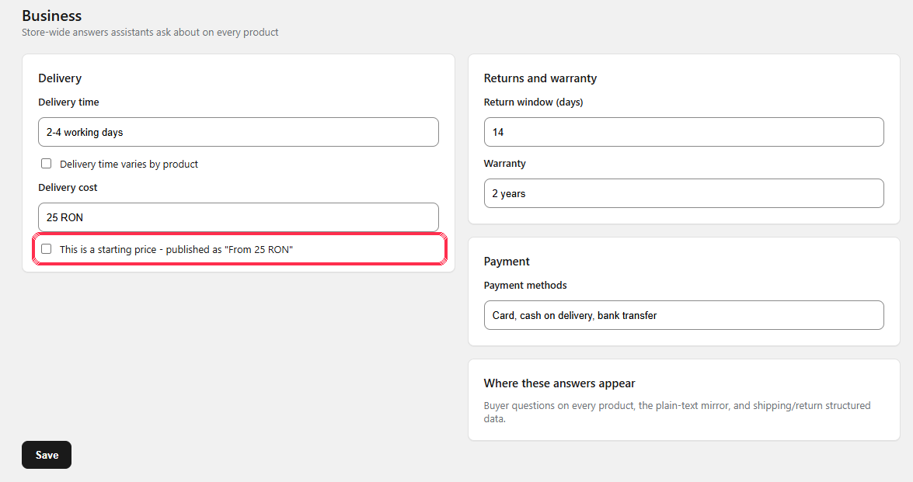

## Step 8 - Describe your images

On the Dashboard, press **Write missing alt text**. Short, specific descriptions built from each product's attributes - never a keyword dump, never over a description a person wrote. Filenames pretending to be descriptions are recognised and replaced.

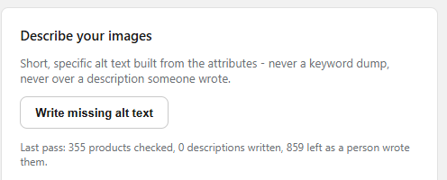

## Step 9 - Check the crawlers can reach you, and see who did

Open **Diagnostics**. Every crawler check verdict is explained in plain language with the fix. Below it, the last fifty real requests AI crawlers made to your plain text pages and llms.txt. These are logged requests, never estimates; the user agent is what the requester claimed, and the app says so.

## Step 10 - Put the panel on your product pages

Open any product in your Shopify admin, scroll to Blocks, press + Block and choose AI Visibility product panel:

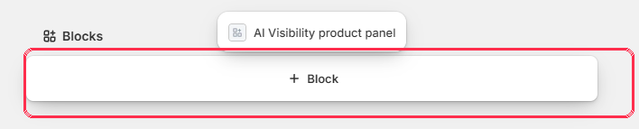

Then press the pin icon - "Pin to page for all staff" - so the panel stays on every product page, for everyone. One time, whole store.

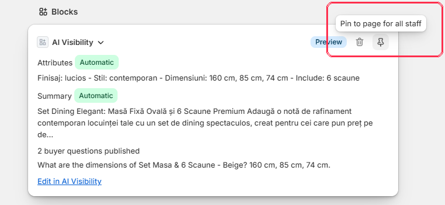

## Step 11 - Read the Report

Open **Report**. It shows how much of the shop AI can read, with the denominator beside every figure: products ready, details found, one of your own products before and after, which kinds of detail your descriptions state, the crawler requests of the last 30 days, what to do worst first, and the ten products worth ten minutes of writing. Every table exports to CSV.

Two settings live at the bottom of that screen, and they are yours to decide: whether sold-out products keep their page (on by default; the page says they are out of stock), and whether unlisted products get one (off by default). Changing either withdraws pages that no longer qualify within a minute.

## Where to see everything at once

The **Products** screen lists every product with what is published for it: attributes, buyer questions, summary, image descriptions, whether you have edited it, whether an assistant has anything to read, and a link to its plain text page. Search by title, SKU or vendor, filter by collection, or narrow to what is missing.

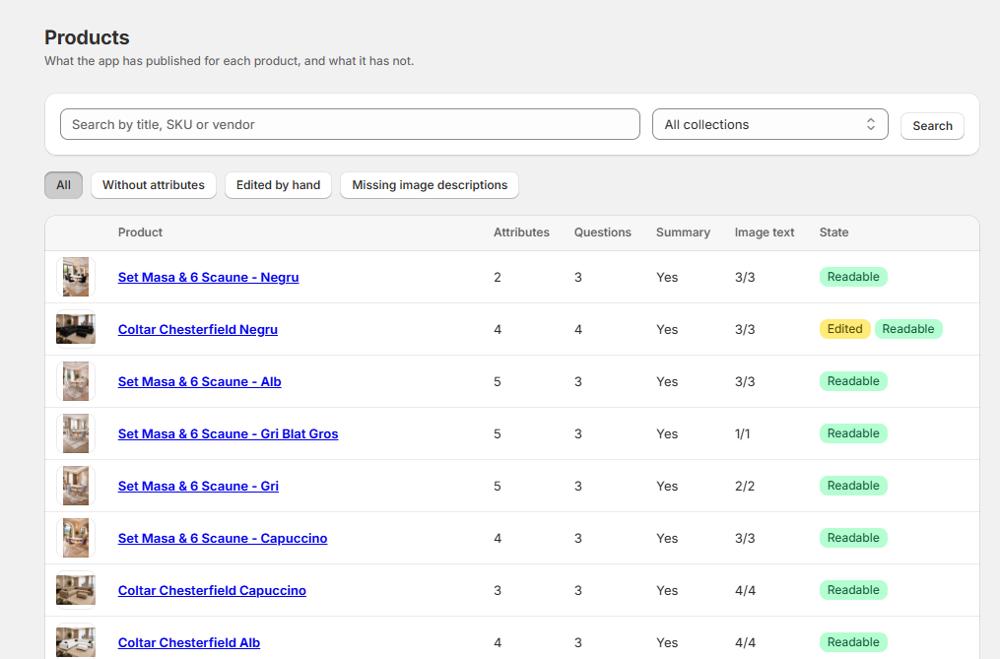

## What an assistant can quote

Open any product from that list. Beside the editable fields, the app shows the answer it can now support - built strictly from what is published, with the values it used named underneath - and the same question answered from the bare product markup. It is not a simulation and not a prediction of any assistant's wording; it is simply what there is to quote.

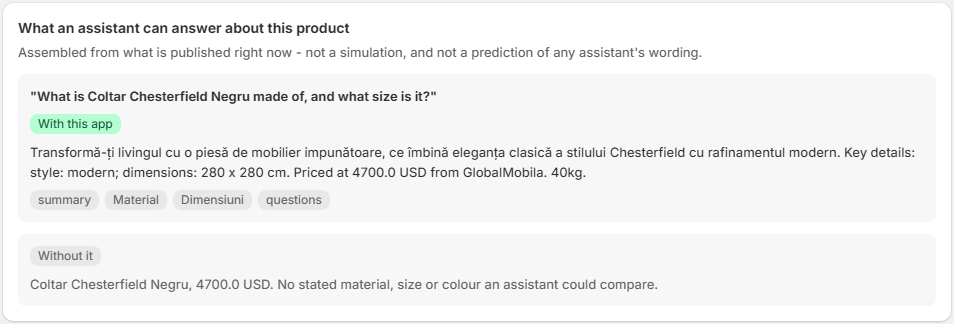

## Fix anything by hand, any time

Everything published is editable: the attributes, the summary, every buyer question, who it suits, and each image description. The badge next to each field tells you who wrote it - Automatic or Edited by you. The moment you change a field, it is yours: bulk passes will never touch it again. "Reset to automatic" hands a field back.

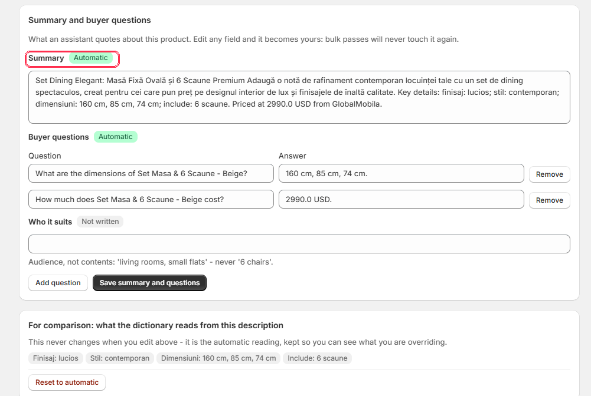

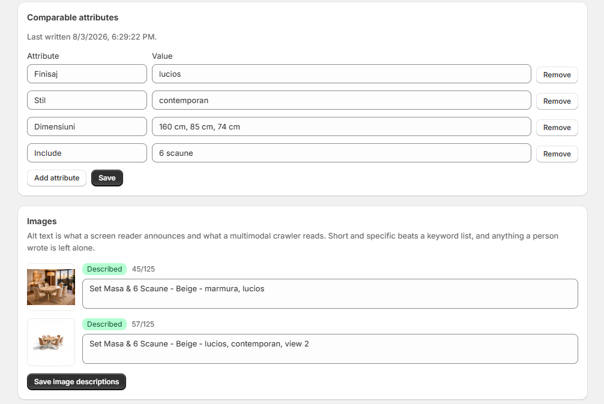

## You are done

From this point the app maintains itself: new and edited products are picked up automatically, products you unpublish, delete or rename lose their public page within a minute, changed pages are pinged to the index ChatGPT search reads from, and your theme's output stays current. It does the bulk work; you keep the last word.

Questions: hello@mrdigital.ro - one working day. Full documentation: mrdigital.ro/ai-visibility-aio/docs-aio/
